<p align="center">
  <h2 align="center">🌊 KANAGAWA.nvim 🌊</h2>
</p>

<p align="center">
  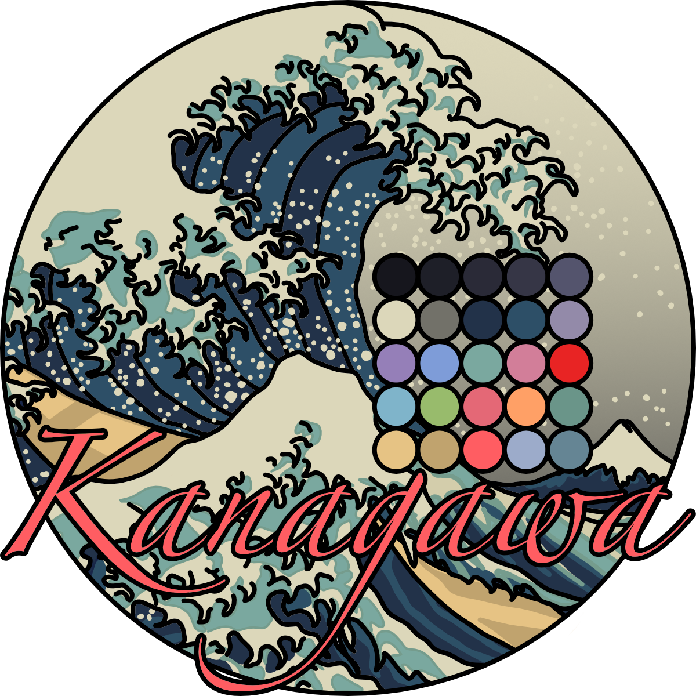
</p>

<p align="center">NeoVim dark colorscheme inspired by the colors of the famous painting by Katsushika Hokusai.</p>

<p align="center">
  <h2 align="center"></h2>
</p>

[](https://www.w3.org/TR/WCAG21/#contrast-minimum)

## Features

- Extensive support for `TreeSitter` syntax highlighting, and _many_ popular plugins
- Compilation to lua byte code for super fast startup times

## Installation

Download with your favorite package manager.

```lua
use "rebelot/kanagawa.nvim"
```

## Requirements

- neovim latest
- truecolor terminal support
- undercurl terminal support (optional)

## Usage

As simple as writing (pasting)

```vim
colorscheme kanagawa
```

```lua
vim.cmd("colorscheme kanagawa")
```

## Configuration

There is no need to call setup if you are ok with the defaults.

```lua
-- Default options:
require('kanagawa').setup({
    compile = false,             -- enable compiling the colorscheme
    undercurl = true,            -- enable undercurls
    commentStyle = { italic = true },
    functionStyle = {},
    keywordStyle = { italic = true},
    statementStyle = { bold = true },
    typeStyle = {},
    transparent = false,         -- do not set background color
    dimInactive = false,         -- dim inactive window `:h hl-NormalNC`
    terminalColors = true,       -- define vim.g.terminal_color_{0,17}
    colors = {                   -- add/modify theme and palette colors
        palette = {},
        theme = { wave = {}, lotus = {}, dragon = {}, all = {} },
    },
    overrides = function(colors) -- add/modify highlights
        return {}
    end,
    theme = "wave",              -- Load "wave" theme
    background = {               -- map the value of 'background' option to a theme
        dark = "wave",           -- try "dragon" !
        light = "lotus"
    },
})

-- setup must be called before loading
vim.cmd("colorscheme kanagawa")
```

**_NOTE 1:_** If you enable compilation, make sure to run `:KanagawaCompile` command every time you make changes to your config.

```vim
" 1. Modify your config
" 2. Restart nvim
" 3. Run this command:
:KanagawaCompile
```

**_NOTE 2:_** Kanagawa adjusts to the value of some options. Make sure that the options `'laststatus'` and `'cmdheight'` are set **_before_** calling `setup`.

## Themes

Kanagawa comes in three variants:

- `wave` the default heart-warming theme,
- `dragon` for those late-night sessions
- `lotus` for when you're out in the open.

Themes can be changed in three ways:

- Setting `config.theme` to the desired theme.
- Using the `background` option:
  Any change to the value of `vim.o.background` will select the theme mapped by `config.background`.
- Loading the colorscheme directly with:

  ```lua
  vim.cmd("colorscheme kanagawa-wave")
  vim.cmd("colorscheme kanagawa-dragon")
  vim.cmd("colorscheme kanagawa-lotus")
  ```

  or

  ```lua
  require("kanagawa").load("wave")
  ```

## Customization

In kanagawa, there are _two_ kinds of colors: `PaletteColors` and `ThemeColors`;
`PaletteColors` are defined directly as RGB Hex strings, and have arbitrary names
that recall their actual color. Conversely, `ThemeColors` are named and grouped _semantically_
on the basis of their actual function.

In short, a `palette` defines all the available colors, while a `theme` maps the `PaletteColors`
to specific `ThemeColors` and the same palette color may be assigned to multiple theme colors.

You can change _both_ theme or palette colors using `config.colors`.
All the palette color names can be found [here](lua/kanagawa/colors.lua),
while their usage by each theme can be found [here](lua/kanagawa/themes.lua).

```lua
require('kanagawa').setup({
    ...,
    colors = {
        palette = {
            -- change all usages of these colors
            sumiInk0 = "#000000",
            fujiWhite = "#FFFFFF",
        },
        theme = {
            -- change specific usages for a certain theme, or for all of them
            wave = {
                ui = {
                    float = {
                        bg = "none",
                    },
                },
            },
            dragon = {
                syn = {
                    parameter = "yellow",
                },
            },
            all = {
                ui = {
                    bg_gutter = "none"
                }
            }
        }
    },
    ...
})
```

You can also conveniently add/modify any `hlgroups` using the `config.overrides` option, allowing you to customize the looks of specific built-in elements, or any other external plugins that provides `hlgroups`. (See `:help highlight` for more information on `hlgroups`.)
Supported keywords are the same for `:h nvim_set_hl` `{val}` parameter.

```lua
require('kanagawa').setup({
    ...,
    overrides = function(colors)
        return {
            -- Assign a static color to strings
            String = { fg = colors.palette.carpYellow, italic = true },
            -- theme colors will update dynamically when you change theme!
            SomePluginHl = { fg = colors.theme.syn.type, bold = true },
        }
    end,
    ...
})
```

### Common customizations

#### Remove _gutter_ background

Remove the background of `LineNr`, `{Sign,Fold}Column` and friends

```lua
colors = {
    theme = {
        all = {
            ui = {
                bg_gutter = "none"
            }
        }
    }
}
```

#### Transparent Floating Windows

This will make floating windows look nicer with default borders.

```lua
overrides = function(colors)
    local theme = colors.theme
    return {
        NormalFloat = { bg = "none" },
        FloatBorder = { bg = "none" },
        FloatTitle = { bg = "none" },

        -- Save an hlgroup with dark background and dimmed foreground
        -- so that you can use it where your still want darker windows.
        -- E.g.: autocmd TermOpen * setlocal winhighlight=Normal:NormalDark
        NormalDark = { fg = theme.ui.fg_dim, bg = theme.ui.bg_m3 },

        -- Popular plugins that open floats will link to NormalFloat by default;
        -- set their background accordingly if you wish to keep them dark and borderless
        LazyNormal = { bg = theme.ui.bg_m3, fg = theme.ui.fg_dim },
        MasonNormal = { bg = theme.ui.bg_m3, fg = theme.ui.fg_dim },
    }
end,
```

If you'd like to keep the floating windows darker, but you're unhappy with how
borders are rendered, consider using characters that are drawn at the edges of
the box:

```lua
{ "🭽", "▔", "🭾", "▕", "🭿", "▁", "🭼", "▏" }
```

#### Borderless Telescope

Block-like _modern_ Telescope UI

```lua
overrides = function(colors)
    local theme = colors.theme
    return {
        TelescopeTitle = { fg = theme.ui.special, bold = true },
        TelescopePromptNormal = { bg = theme.ui.bg_p1 },
        TelescopePromptBorder = { fg = theme.ui.bg_p1, bg = theme.ui.bg_p1 },
        TelescopeResultsNormal = { fg = theme.ui.fg_dim, bg = theme.ui.bg_m1 },
        TelescopeResultsBorder = { fg = theme.ui.bg_m1, bg = theme.ui.bg_m1 },
        TelescopePreviewNormal = { bg = theme.ui.bg_dim },
        TelescopePreviewBorder = { bg = theme.ui.bg_dim, fg = theme.ui.bg_dim },
    }
end,
```

#### Dark completion (popup) menu

More uniform colors for the popup menu.

```lua
overrides = function(colors)
    local theme = colors.theme
    return {
        Pmenu = { fg = theme.ui.shade0, bg = theme.ui.bg_p1 },  -- add `blend = vim.o.pumblend` to enable transparency
        PmenuSel = { fg = "NONE", bg = theme.ui.bg_p2 },
        PmenuSbar = { bg = theme.ui.bg_m1 },
        PmenuThumb = { bg = theme.ui.bg_p2 },
    }
end,
```

#### Tint background of diagnostic messages with their foreground color

This immitates a style of diagnostic messages seen, for example, in [tokyonight.nvim](https://github.com/folke/tokyonight.nvim).

```lua
overrides = function(colors)
  local theme = colors.theme
  local makeDiagnosticColor = function(color)
    local c = require("kanagawa.lib.color")
    return { fg = color, bg = c(color):blend(theme.ui.bg, 0.95):to_hex() }
  end

  return {
    DiagnosticVirtualTextHint  = makeDiagnosticColor(theme.diag.hint),
    DiagnosticVirtualTextInfo  = makeDiagnosticColor(theme.diag.info),
    DiagnosticVirtualTextWarn  = makeDiagnosticColor(theme.diag.warning),
    DiagnosticVirtualTextError = makeDiagnosticColor(theme.diag.error),
  }
end
```

## Integration

### Get palette and theme colors

```lua
-- Get the colors for the current theme
local colors = require("kanagawa.colors").setup()
local palette_colors = colors.palette
local theme_colors = colors.theme

-- Get the colors for a specific theme
local wave_colors = require("kanagawa.colors").setup({ theme = 'wave' })
```

### Terminal integration

The following example provides a snippet to automatically change the theme
for the Kitty terminal emulator.

```lua
vim.api.nvim_create_autocmd("ColorScheme", {
    pattern = "kanagawa",
    callback = function()
        if vim.o.background == "light" then
            vim.fn.system("kitty +kitten themes Kanagawa_light")
        elseif vim.o.background == "dark" then
            vim.fn.system("kitty +kitten themes Kanagawa_dragon")
        else
            vim.fn.system("kitty +kitten themes Kanagawa")
        end
    end,
})
```

<details>
<summary><h2>Color palette</h2></summary>

|                                                         | Name          |    Hex    | Usage                                                                             |
| :-----------------------------------------------------: | :------------ | :-------: | :-------------------------------------------------------------------------------- |
|   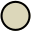   | fujiWhite     | `#DCD7BA` | Default foreground                                                                |
|   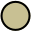    | oldWhite      | `#C8C093` | Dark foreground (statuslines)                                                     |
|       | sumiInk0      | `#16161D` | Dark background (statuslines and floating windows)                                |
|       | sumiInk1      | `#1F1F28` | Default background                                                                |
|       | sumiInk2      | `#2A2A37` | Lighter background (colorcolumn, folds)                                           |
|       | sumiInk3      | `#363646` | Lighter background (cursorline)                                                   |
|       | sumiInk4      | `#54546D` | Darker foreground (line numbers, fold column, non-text characters), float borders |
|      | waveBlue1     | `#223249` | Popup background, visual selection background                                     |
|      | waveBlue2     | `#2D4F67` | Popup selection background, search background                                     |
|  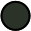  | winterGreen   | `#2B3328` | Diff Add (background)                                                             |
| 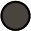  | winterYellow  | `#49443C` | Diff Change (background)                                                          |
|      | winterRed     | `#43242B` | Diff Deleted (background)                                                         |
|     | winterBlue    | `#252535` | Diff Line (background)                                                            |
|  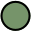  | autumnGreen   | `#76946A` | Git Add                                                                           |
|      | autumnRed     | `#C34043` | Git Delete                                                                        |
| 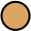  | autumnYellow  | `#DCA561` | Git Change                                                                        |
|     | samuraiRed    | `#E82424` | Diagnostic Error                                                                  |
|    | roninYellow   | `#FF9E3B` | Diagnostic Warning                                                                |
|      | waveAqua1     | `#6A9589` | Diagnostic Info                                                                   |
|     | dragonBlue    | `#658594` | Diagnostic Hint                                                                   |
|   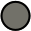    | fujiGray      | `#727169` | Comments                                                                          |
|  | springViolet1 | `#938AA9` | Light foreground                                                                  |
|      | oniViolet     | `#957FB8` | Statements and Keywords                                                           |
|    | crystalBlue   | `#7E9CD8` | Functions and Titles                                                              |
|  | springViolet2 | `#9CABCA` | Brackets and punctuation                                                          |
|     | springBlue    | `#7FB4CA` | Specials and builtin functions                                                    |
|      | lightBlue     | `#A3D4D5` | Not used                                                                          |
|      | waveAqua2     | `#7AA89F` | Types                                                                             |
|  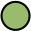  | springGreen   | `#98BB6C` | Strings                                                                           |
|  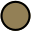  | boatYellow1   | `#938056` | Not used                                                                          |
|  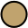  | boatYellow2   | `#C0A36E` | Operators, RegEx                                                                  |
|  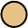   | carpYellow    | `#E6C384` | Identifiers                                                                       |
|     | sakuraPink    | `#D27E99` | Numbers                                                                           |
|        | waveRed       | `#E46876` | Standout specials 1 (builtin variables)                                           |
|       | peachRed      | `#FF5D62` | Standout specials 2 (exception handling, return)                                  |
| 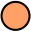  | surimiOrange  | `#FFA066` | Constants, imports, booleans                                                      |
|     | katanaGray    | `#717C7C` | Deprecated                                                                        |

</details>

## Accessibility

The colors maintain a `4.5:1` contrast ratio, complying with [WCAG 2.1 | Level AA](https://www.w3.org/TR/WCAG21/#contrast-minimum).

## Extras

- [Alacritty](extras/alacritty/)
- [Alfred](extras/alfred.md)
- [Base16](extras/base16/)
- [Broot](extras/broot/)
- [Emacs](extras/emacs/)
- [Fish](extras/fish/)
- [Foot](extras/foot/)
- [iTerm](extras/iterm/)
- [Kitty](extras/kitty/)
- [Mintty](extras/mintty/)
- [Pywal](extras/pywal/)
- [Sway](extras/sway/)
- [Wezterm](extras/wezterm/)
- [Windows Terminal](extras/windows-terminal/)
- [Ghostty](extras/ghostty)
- [Xresources](extras/xresources/)
- [tmTheme (Sublime Text, bat and delta)](extras/textmate/)
- [JSON compatible with many terminals](extras/gogh/) Check [Gogh](https://github.com/Gogh-Co/Gogh#-terminals) for the list of supported terminals.
- 🎉 Bonus! You win a tiny [python script](palette.py)🐍 to extract color palettes 🎨 from any image! 🥳

## Acknowledgements

- [Tokyonight](https://github.com/folke/tokyonight.nvim)
- [Gruvbox](https://github.com/morhetz/gruvbox)
- [Catppuccin](https://github.com/catppuccin/nvim)
- [Affinity Designer](https://affinity.serif.com/designer/)

### Donate

Buy me coffee and support my work ;)

[](https://www.paypal.com/donate/?business=VNQPHGW4JEM3S&no_recurring=0&item_name=Buy+me+coffee+and+support+my+work+%3B%29&currency_code=EUR)
