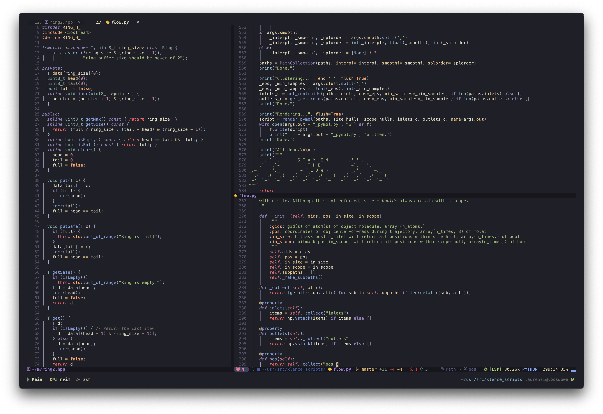

<p align="center">
  <h2 align="center">🌊 KANAGAWA.nvim 🌊</h2>
</p>

<p align="center">
  
</p>

<p align="center">NeoVim dark colorscheme inspired by the colors of the famous painting by Katsushika Hokusai.</p>

<p align="center">
  <h2 align="center"></h2>
</p>

## Installation

Download with your favorite package manager.

```lua
use "rebelot/kanagawa.nvim"
```

## Requirements

* neovim >= 0.6
* truecolor terminal support
* undercurl terminal support (optional)

## Usage

As simple as writing (pasting)

```vim
colorscheme kanagawa
```

```lua
vim.cmd("colorscheme kanagawa")
```

## Plugin Support

- [Nvim cmp](https://github.com/hrsh7th/nvim-cmp)
- [TreeSitter](https://github.com/nvim-treesitter/nvim-treesitter)
- [LSP Diagnostics](https://neovim.io/doc/user/lsp.html)
- [Git Signs](https://github.com/lewis6991/gitsigns.nvim)
- [Telescope](https://github.com/nvim-telescope/telescope.nvim)
- [NvimTree](https://github.com/kyazdani42/nvim-tree.lua)
- [Indent Blankline](https://github.com/lukas-reineke/indent-blankline.nvim)
- [Dashboard](https://github.com/glepnir/dashboard-nvim)
- [Lualine](https://github.com/nvim-lualine/lualine.nvim)

And many others should _"just work"_!

## Configuration

There is no need to call setup if you are ok with the defaults.

```lua
-- Default options:
require('kanagawa').setup({
    undercurl = true,           -- enable undercurls
    commentStyle = "italic",
    functionStyle = "NONE",
    keywordStyle = "italic",
    statementStyle = "bold",
    typeStyle = "NONE",
    variablebuiltinStyle = "italic",
    specialReturn = true,       -- special highlight for the return keyword
    specialException = true,    -- special highlight for exception handling keywords 
    transparent = false,        -- do not set background color
    colors = {},
    overrides = {},
})

-- setup must be called before loading
vim.cmd("colorscheme kanagawa")
```

### Customize highlight groups and colors

You can change the colors of existing hl-groups as well as creating new ones. Supported keywords: `fg`, `bg`, `style`, `guisp`, `link`.

You can define your own colors or use the theme colors (see example below).
All the palette colors can be found [here](lua/kanagawa/colors.lua).

Example:

```lua
local default_colors = require("kanagawa").colors

local overrides = {
    -- create a new hl-group using default palette colors and/or new ones
    MyHlGroup1 = { fg = default_colors.waveRed, bg = "#AAAAAA", style="underline,bold", guisp="blue" },

    -- override existing hl-groups, the new keywords are merged with existing ones
    VertSplit  = { fg = default_colors.bg_dark, bg = "NONE" },
    TSError    = { link = "Error" },
    TSKeywordOperator = { style = 'bold'}
}

-- this will affect all the hl-groups where the redefined colors are used
local colors = {
    sumiInk1 = "black",
    fujiWhite = "#FFFFFF"
}

require'kanagawa'.setup({ overrides = overrides, colors = colors })
vim.cmd("colorscheme kanagawa")
```

## Extras

* [kitty](extras/kanagawa.conf)
* [iTerm](extras/kanagawa.itermcolors)
* [alacritty](extras/alacritty_kanagawa.yml)
* 🎉 Bonus! You win a tiny [python script](palette.py)🐍 to extract color palettes 🎨 from images! 🥳

## Acknowledgements

* [Tokyonight](https://github.com/folke/tokyonight.nvim)
* [Gruvbox](https://github.com/morhetz/gruvbox)
* [Affinity Designer](https://affinity.serif.com/designer/)

## Related projects
* [kanagawa.vim](https://github.com/guigui64/kanawaga.vim) - unaffiliated vimscript port of kanagawa.nvim
